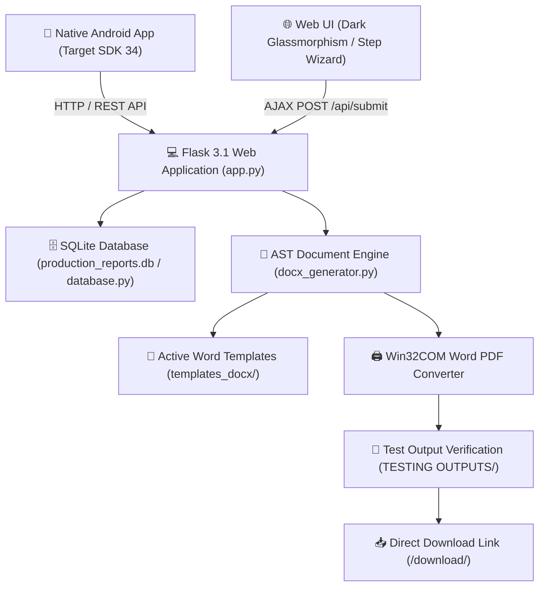

 Production Report & Calibration Documentation System (IPA Private Limited)

[](https://flask.palletsprojects.com/)
[](https://python.org)
[-orange.svg)](https://developer.android.com)
[](https://sqlite.org)
[]()

The **APEX ProScale™ Industrial Suite** is an enterprise-grade web, document generation, and mobile calibration reporting system designed for field technicians, inspectors, and plant management. It streamlines test data entry across **24 industrial weighing and measurement systems**, automates pixel-perfect Microsoft Word (`.docx`) report population, and generates single-page/multi-page PDFs using MS Word COM automation.

---

## 📐 Architecture Overview



---

## 📊 Feature Inventory & System Categorization

| # | System Name | Category | Route | Template File |
|---|-------------|----------|-------|---------------|
| 1 | **ODD System Controller** | Alstom / Controller | `/odd-system` | `PP-05_18_A ODD System.docx` |
| 2 | **DD System Controller** | Alstom / Controller | `/dd-system` | `PP-05_18_B DD System.docx` |
| 3 | **Belt Scale System** | Production System | `/belt-scale` | `PP-05_03 Belt Scale.docx` |
| 4 | **Job Traveller Card** | Production System | `/job-traveller-card` | `PP-05_02 Job Traveller Card.docx` |
| 5 | **Batching System** | Production System | `/batching-system` | `PP-05_04 Batching System.docx` |
| 6 | **Remote Indicator** | Production System | `/remote-indicator` | `PP-05_05 Remote Indicator.docx` |
| 7 | **Digital Indicator** | Production System | `/digital-indicator` | `PP-05_06 Digital Indicator.docx` |
| 8 | **Weigh Feeder** | Production System | `/weigh-feeder` | `PP-05_07 Weigh Feeder.docx` |
| 9 | **Crane Scale (CWS)** | Production System | `/crane-scale` | `PP-05_08 Crane Scale.docx` |
| 10 | **Signal Conditioner** | Production System | `/signal-conditioner` | `PP-05_09 Signal Conditioner.docx` |
| 11 | **Trip Safe System** | Production System | `/trip-safe` | `PP-05_10 tRIP sAFE.docx` |
| 12 | **Vibration Switch** | Production System | `/vibration-switch` | `PP-05_11 Vibration Switch.docx` |
| 13 | **ACC mV Indicator** | Production System | `/acc-mv` | `PP-05_12 ACC mV.docx` |
| 14 | **ACC Charge Unit** | Production System | `/acc-charge` | `PP-05_13 ACC Charge.docx` |
| 15 | **Vibration Meter** | Production System | `/vibration-meter` | `PP-05_14 Vibration Meter.docx` |
| 16 | **Charge Amplifier** | Production System | `/charge-amplifier` | `PP-05_15 Charge Amplifier.docx` |
| 17 | **Inprocess Register** | Production System | `/inprocess-register` | `PP-05_16 Inprocess.docx` |
| 18 | **Work Instructions** | Production System | `/work-instructions` | `PP-05_19 Work Instructions.docx` |
| 19 | **Performance Index** | Production System | `/performance-index` | `PP-05_20 Performance Index.docx` |
| 20 | **Delay Analysis** | Production System | `/performance-delay-analysis` | `PP-05_21 Performance Delay Analysis.docx` |
| 21 | **Equipment List** | Production System | `/equipment-list` | `PP-05_22 Equipment List.docx` |
| 22 | **Loss in Weigh Feeder**| Production System | `/loss-in-weigh-feeder` | `PP-05_24 Loss in Weigh Feeder.docx` |
| 23 | **Miscellaneous Item** | Production System | `/misc-report` | `PP-05_17 Miscellaneous Items.docx` |

---

## ⚡ Quick Start Guide

### Option 1: VS Code 1-Click Launch (Recommended)
1. Open this repository folder in VS Code.
2. Press **`F5`** (or click **Run -> Start Debugging**).
3. VS Code will automatically start the Flask server on `http://localhost:5000`.

### Option 2: Command Line / Batch Script
```bash
# Double-click run_server.bat OR run from command line:
python app.py
```

### Accessing the Web Application
* **Portal Hub**: [`http://localhost:5000/portal`](http://localhost:5000/portal)
* **Admin Dashboard**: [`http://localhost:5000/admin/portal`](http://localhost:5000/admin/portal) (Credentials: `admin` / `admin`)
* **Mobile / Wi-Fi Access**: Open `http://<YOUR_LAPTOP_IP>:5000` on any mobile phone or tablet connected to the same Wi-Fi network.

---

## 📡 REST API Reference

### 1. Submit Test Report & Generate PDF
* **Endpoint**: `POST /api/submit`
* **Content-Type**: `application/json`
* **Sample Payload**:
```json
{
  "report_type": "belt_scale",
  "user_name": "Field Technician",
  "job_no": "JOB-2026-101",
  "customer": "National Steel Corp",
  "capacity": "500 TPH",
  "date": "2026-08-24",
  "tested_by": "Senior Inspector",
  "approved_by": "HOD-PDN"
}
```
* **Sample Response**:
```json
{
  "status": "success",
  "message": "Report submitted and document generated successfully!",
  "record_id": 1,
  "docx_filename": "belt_scale_JOB2026101_FieldTechnician.docx",
  "pdf_filename": "belt_scale_JOB2026101_FieldTechnician.pdf",
  "pdf_download_url": "/download/belt_scale_JOB2026101_FieldTechnician.pdf"
}
```

### 2. Download Generated Reports or Mobile APK
* **Endpoint**: `GET /download/<filename>`
* **Description**: Downloads generated `.pdf` or `.docx` reports from `TESTING OUTPUTS/` or distribution APKs (`ProductionReportApp.apk`) from `apks/`.

---

## 🧪 Automated Verification & Testing

To run full end-to-end automated verification across all system fixtures:

```bash
# Run 20-System End-to-End Verification Test:
python verify_systems.py

# Or in VS Code: Press Ctrl+Shift+B -> Run E2E Verification Tests
```

---

## 📁 Repository Directory Structure

```
TEST REPORT PRODUCTION final/
├── .vscode/                       # VS Code F5 & Keyboard Shortcut Configurations
├── apks/                          # Android Distribution APKs (ProductionReportApp.apk)
├── android_app/                   # Full Android Studio Source Project
├── static/                        # CSS Dark Glassmorphism Styling & Client JS Utilities
├── templates/                     # Jinja2 HTML Views for All 24 Systems
├── templates_docx/                # Canonical Microsoft Word (.docx) Templates
├── legacy_templates/              # Original Unfilled Document References
├── scripts/                       # Reorganized Patch, Check & Utility Scripts
├── tests/                         # End-to-End Verification & Mass Test Suite
├── TESTING OUTPUTS/               # Generated DOCX and PDF Output Directory
├── app.py                         # Pure Python Flask 3.1 Application Backend
├── database.py                    # SQLite Persistence & Record Tracking
├── docx_generator.py              # Word AST Population & MS Word COM PDF Converter
├── production_reports.db                  # SQLite Production Database
├── README.md                      # Primary Architecture & Setup Documentation
├── PROJECT.md                     # Technical Architecture & Milestone Record
├── RULES.md                       # Mandatory Project Rules & UI Boundaries
├── requirements.txt               # Required Python Package Dependencies
└── run_server.bat                 # Windows 1-Click Server Execution Script
```

---
*Created for IPA Private Limited - APEX ProScale™ Systems*
